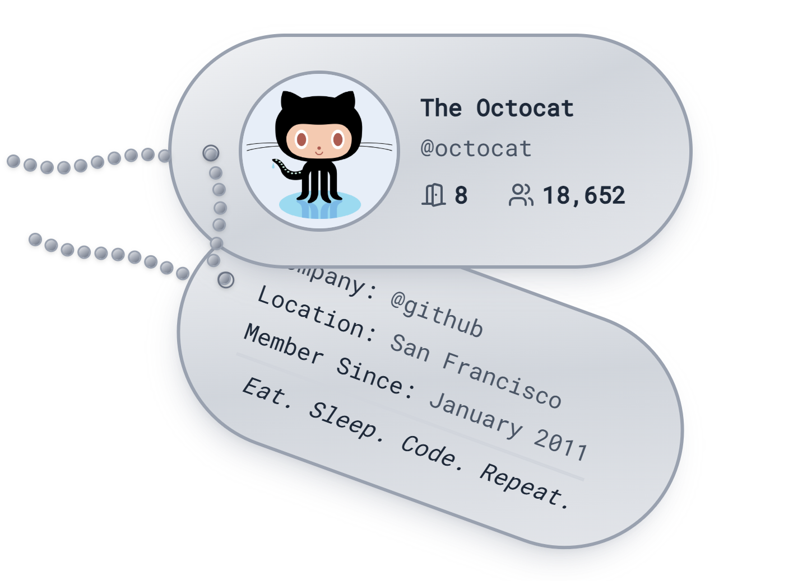

# 🐶 GitHub Dog Tag Generator



A fun and customizable **Dog Tag generator** for your GitHub profile, built with **React**, **TypeScript**, and **Vite**.  
Easily add flair to your **GitHub README** or even your **developer portfolio** with a badge-style tag featuring your GitHub username, avatar, and custom styling.

---

## 🚀 Getting Started (Run Locally)

Follow these steps to run the app locally:

```bash
# 1. Clone the repository
git clone https://github.com/your-username/github-dog-tag-generator.git

# 2. Navigate into the project folder
cd github-dog-tag-generator

# 3. Install dependencies
npm install

# 4. Start the development server
npm run dev
